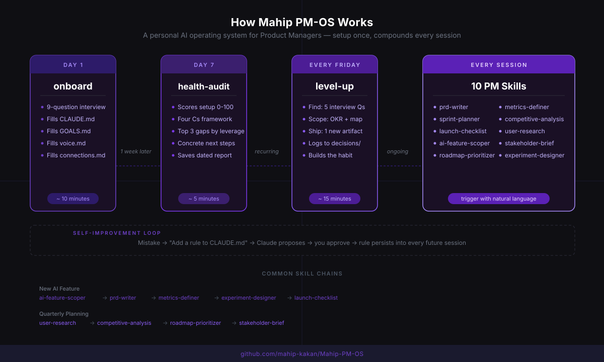
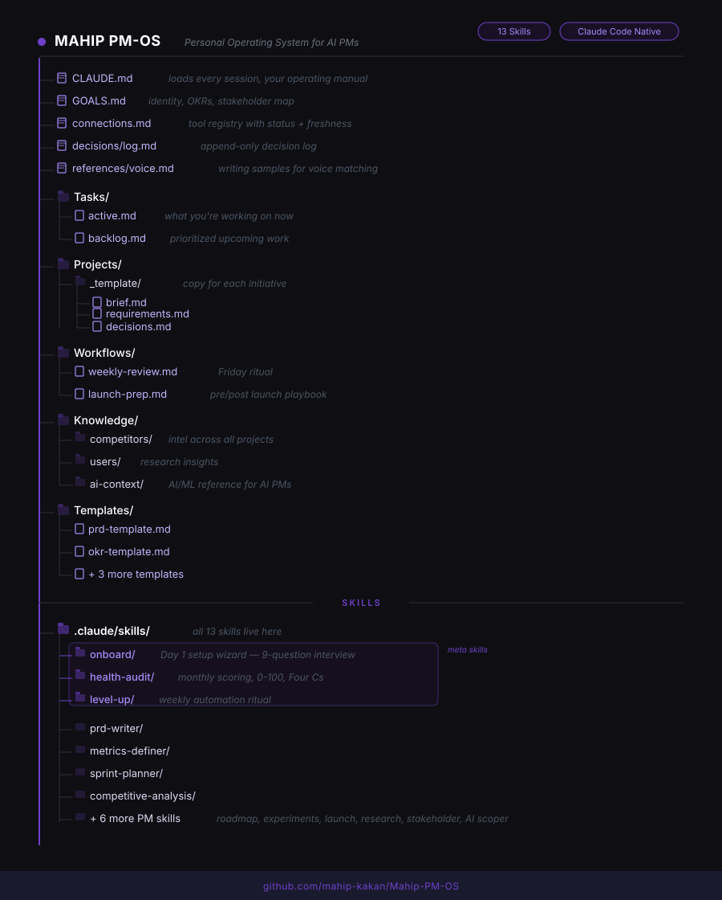

<div align="center">


<br/>


<br/><br/>


<br/><br/>

</div>

---

## The Problem

Most PMs use Claude like a smarter Google. You paste in context every session, re-explain your product, re-describe your stakeholders, and hope the output is useful.

Mahip PM-OS fixes that.

It gives Claude a persistent memory of who you are, what you are building, and how you think. Every session starts with full context. Every skill knows your metrics, your users, and your voice. The more you use it, the sharper it gets.

---

## What Ships in the Box

<div align="center">

| | Component | What it does |
|--|-----------|-------------|
| 🧠 | **Persistent context files** | `CLAUDE.md` and `GOALS.md` load automatically every session |
| 🎙️ | **Personalized onboarding** | 14-question interview — platform, persona, PRDs, voice, active projects |
| 🔍 | **Health audit** | Scores your setup 0-100, surfaces top gaps by leverage |
| ⚡ | **Level-up ritual** | Weekly automation discovery — one run ships one new skill |
| 📝 | **22 PM work skills** | PRDs, discovery, red-team, experiments, SQL, meetings, and more |
| ⚙️ | **4 slash commands** | `/discover`, `/red-team-prd`, `/analyze-test`, `/meeting-notes` |
| 🗣️ | **Voice matching** | Drafts comms in your writing style, not a generic template |
| 🔗 | **Connections registry** | Tracks every tool you use and its integration status |
| 📓 | **Decision log** | Append-only record of every significant trade-off |
| 🔄 | **Self-improvement loop** | Claude proposes rules when it makes mistakes. You approve. They stick. |

</div>

---

## How It Works

<div align="center">

</div>

---

## The Three Principles

**1. Context over repetition.**
Claude should know your goals, your team, and your product without you explaining it every session. You fill in the context once. It persists forever.

**2. Skills over one-off prompts.**
Repeatable PM work belongs in skills, not your clipboard. PRDs, sprint plans, metrics stacks, experiment designs: each one is a skill with methodology built in.

**3. Start lean, grow intentionally.**
The system ships with exactly what you need. Add more structure only when you feel friction. See `EXPANSIONS.md` for guidance on when to add what.

---

## Getting Started

### Step 1 — Clone the repo

```bash
git clone https://github.com/mahip-kakan/Mahip-PM-OS.git
cd Mahip-PM-OS
```

### Step 2 — Open in Claude Code or Cowork

**Claude Code (terminal):**
```bash
claude
```

**Claude Cowork (desktop):** Open this folder as your workspace. See [`docs/setup-cowork.md`](docs/setup-cowork.md).

Claude picks up `CLAUDE.md` automatically. On a fresh clone:

> *"Hi! Looks like this is a fresh install of Mahip PM-OS. Setup takes about 15–20 minutes. Say 'onboard me' or 'let's go'."*

### Step 3 — Run onboarding

Say **"onboard me"**. One question at a time — platform, persona, product, **your existing PRDs and docs**, voice, tools, active projects.

<div align="center">

| Phase | What you are asked | What gets filled |
|-------|-------------------|-----------------|
| **Setup** | Platform (Cowork / Code / Cursor) and persona (PM, CPO, CSO, etc.) | `references/platform.md`, `GOALS.md` |
| **Identity** | Name, role, company, product, users, OKRs, metrics, stakeholders | `CLAUDE.md`, `GOALS.md` |
| **People** | **Boss/manager**, stakeholders, **competitors** | `GOALS.md`, `Knowledge/competitors/` |
| **Personal** | Writing samples (paste raw), daily tools | `references/voice.md`, `connections.md` |
| **Documents** | Upload PRDs, roadmaps, research — **auto-summarized and filed** | `Projects/`, `Knowledge/`, `references/documents-index.md` |
| **Active work** | What you're working on right now | `Tasks/active.md`, `Projects/[slug]/` |
| **Terminology** | Acronyms and internal product language | `references/product-context.md`, `CLAUDE.md` |
| **Growth** | Repetitive weekly task, development goals | `GOALS.md` |

</div>

**Have ready before you start:** a recent email/Slack message, your quarterly priorities, and links or paths to your main PRD or product brief.

At the end:

> *"Setup complete. Ask me: what should I focus on this week?"*

That response cites your OKRs, active projects, and product docs — not a generic template.

### Step 4 — Add your first real task

Open `Tasks/active.md` and add something you are actually working on right now:

```markdown
## Task name
**Goal:** What done looks like
**Due:** Date or sprint
**Status:** In Progress / Blocked / Review
**Notes:** Anything Claude needs to know
```

### Step 5 — Try a skill or command

```
"Write a PRD for [your next feature]"    →  prd-writer
"/discover [feature idea]"               →  full discovery cycle
"/red-team-prd @Projects/.../requirements.md"
"/meeting-notes [paste transcript]"
"Define metrics for [feature]"           →  metrics-definer
```

---

## The Skills

<div align="center">

### System Meta Skills
*Run these first. They build, score, and improve the system itself.*

</div>

---

<details>
<summary><strong>onboard</strong> — Day 1 setup wizard</summary>

<br/>

Runs a **14-question personalized interview** — platform, persona (PM / CPO / CSO / CTO / CEO), product context, **existing PRDs and documentation**, voice samples, tools, active projects, and terminology. Pushes back on vague answers. Accepts `@file` paths and pasted doc summaries.

Idempotent: re-run when you change roles, products, or priorities.

```
Trigger: "onboard me"  /  "set me up"  /  "let's get started"
```

</details>

---

<details>
<summary><strong>health-audit</strong> — Monthly system scoring</summary>

<br/>

Scores your PM-OS from 0 to 100 across four dimensions:

- **Context (25 pts)** — Is the system filled in? Does Claude know who you are?
- **Connections (25 pts)** — Can it reach your tools? Is anything stale or broken?
- **Capabilities (25 pts)** — Are the right skills installed? Are templates being used?
- **Cadence (25 pts)** — Is the system being used regularly? Are OKRs being tracked?

Surfaces your top 3 gaps ranked by leverage multiplier, not just by points lost. Each gap comes with a one-line concrete next step. Optionally saves a dated report to `audits/` so you can track your score over time.

Stage thresholds: 0-39 Not Yet Running, 40-69 Operational, 70-89 Compounding, 90-100 High Performance.

```
Trigger: "audit my setup"  /  "score my PM-OS"  /  "health check"
```

</details>

---

<details>
<summary><strong>level-up</strong> — Weekly Friday automation ritual</summary>

<br/>

Three-phase PM automation discovery interview:

**Phase 1 — Find:** Five questions about your week surface 1-3 manual PM workflows worth automating. Ranked by leverage.

**Phase 2 — Scope:** One workflow gets scoped correctly: OKR connection, eliminate-first check, full process map (trigger, inputs, steps, decision points, output), autonomy level (L1-L4), and a named metric for the improvement.

**Phase 3 — Ship:** One artifact gets built: a new skill, a workflow playbook, or a saved prompt template. Logged to `decisions/log.md`.

Run this every Friday. After 4-6 sessions, you start spotting automation candidates mid-week without being prompted. The questions become internalized.

```
Trigger: "level up"  /  "what should I automate"  /  "find me leverage this week"
```

</details>

---

<div align="center">

### PM Work Skills
*These do the actual work. Trigger with natural language.*

</div>

---

<details>
<summary><strong>prd-writer</strong> — Full Product Requirements Document</summary>

<br/>

Asks clarifying questions before generating anything. Calibrates depth to the stage of the feature: early exploration gets a lighter spec, ready-to-build gets the full treatment. Flags missing information with `[NEED: data from X]` rather than fabricating it. Runs a self-review checklist at the end before handing off.

```
Trigger: "write a PRD for [feature]"  /  "draft a spec for [X]"
```

</details>

---

<details>
<summary><strong>metrics-definer</strong> — Complete metric stack</summary>

<br/>

Defines five layers: primary metric, secondary metrics, guardrail metrics, leading indicators, and anti-metrics (metrics that look good but mask problems). Requires baselines — will ask for them if not provided. Warns explicitly against vanity metrics and against having a primary metric with no guardrail.

```
Trigger: "define metrics for [feature]"  /  "what should I track for [X]"
```

</details>

---

<details>
<summary><strong>sprint-planner</strong> — Capacity-checked sprint plan</summary>

<br/>

Plans at 80% of theoretical capacity, not 100%. Flags every unresolved dependency before the sprint starts. Produces a sprint goal tied to the quarterly OKR, not just a list of tickets.

```
Trigger: "plan this sprint"  /  "help me plan sprint [N]"
```

</details>

---

<details>
<summary><strong>competitive-analysis</strong> — Structured competitive intelligence</summary>

<br/>

Uses the Smart / Weak / Implications framework. Synthesizes across multiple competitors in one pass rather than one at a time. Saves findings to `Knowledge/competitors/` so they persist across future sessions and do not need to be rediscovered.

```
Trigger: "analyze competitor [X]"  /  "competitive analysis for [space]"
```

</details>

---

<details>
<summary><strong>launch-checklist</strong> — Risk-calibrated launch plan</summary>

<br/>

Adjusts depth based on launch risk: low, medium, or high. Every checklist item has an owner slot. High-risk launches get a rollback plan template included automatically.

```
Trigger: "create a launch checklist for [feature]"  /  "pre-launch checklist"
```

</details>

---

<details>
<summary><strong>user-research</strong> — Research synthesis</summary>

<br/>

Synthesizes raw interview notes, survey responses, or support tickets into evidence-ranked findings. Explicitly separates what users said from what they actually did. Surfaces patterns, tensions, and surprises as three distinct categories. Flags low-evidence conclusions so you know what is observation vs. inference.

```
Trigger: "synthesize this research"  /  "analyze these interview notes"
```

</details>

---

<details>
<summary><strong>ai-feature-scoper</strong> — Purpose-built for AI PMs</summary>

<br/>

Scopes AI features across 10 areas before a single line of spec gets written: model type, training data requirements, evaluation strategy, failure modes, human override design, latency constraints, cost modeling, ethical risk assessment, production metrics, and rollout strategy. This skill runs before `prd-writer` for any AI feature, not after.

```
Trigger: "scope this AI feature"  /  "I want to add AI to [area]"
```

</details>

---

<details>
<summary><strong>stakeholder-brief</strong> — Audience-adapted communications</summary>

<br/>

Adapts tone, structure, and depth to the recipient: async brief, executive update, or meeting presentation. Pulls your stakeholder context from `GOALS.md` so it knows how each person prefers to receive information. Includes a dedicated section for difficult situations: delivering bad news, handling disagreement, and communicating under uncertainty.

```
Trigger: "write a stakeholder brief"  /  "draft an executive update"
```

</details>

---

<details>
<summary><strong>roadmap-prioritizer</strong> — RICE scoring with strategic fit</summary>

<br/>

RICE scoring plus a strategic fit filter applied together. Produces a tiered roadmap (Now / Next / Later), explicit deprioritizations with rationale, and named trade-offs. Flags "scoring theater": when the numbers look clean but the actual decision is still ambiguous, it says so directly.

```
Trigger: "prioritize these features"  /  "help me build the roadmap"
```

</details>

---

<details>
<summary><strong>experiment-designer</strong> — Statistically sound A/B tests</summary>

<br/>

Covers the full design: hypothesis validation, minimum detectable effect, sample size calculation, test duration, and decision criteria pre-registered before results come in. Warns against peeking at results mid-test (p-hacking) and against tests that run longer than 8 weeks, which become vulnerable to novelty effects and seasonal drift.

```
Trigger: "design an experiment for [hypothesis]"  /  "help me set up an A/B test"
```

</details>

---

## Commands

Slash workflows in `.claude/commands/`:

| Command | What it does |
|---------|--------------|
| `/discover` | Assumption mapping → prioritize → experiment design |
| `/red-team-prd` | Stress-test a PRD or strategy before you commit |
| `/analyze-test` | Interpret A/B results — ship, extend, or stop |
| `/meeting-notes` | Transcript → decisions, actions → `Meetings/` |
| `/ingest-document` | Upload → classify, summarize, save, update indexes |

---

## Skill Chaining Patterns

<div align="center">

| Workflow | Chain |
|---------|-------|
| Discovery → spec | `/discover` → `prd-writer` → `/red-team-prd` → `metrics-definer` |
| New AI feature | `ai-feature-scoper` → `prd-writer` → `metrics-definer` → `experiment-designer` → `pre-mortem` → `launch-checklist` |
| Customer research | `interview-script` → `summarize-interview` → `user-research` |
| Experiment lifecycle | `experiment-designer` → `/analyze-test` → `stakeholder-brief` |
| Data-informed PRD | `sql-queries` → `prd-writer` → `metrics-definer` |
| After meetings | `/meeting-notes` → `Tasks/active.md` → `decisions/log.md` |
| Day 1 setup | `onboard` → "what should I focus on this week?" |

</div>

Full index: [`_Registry/skill-index.md`](_Registry/skill-index.md)

---

## Folder Structure

<div align="center">

</div>

```
Mahip-PM-OS/
│
├── CLAUDE.md                  # Loads automatically every session. Your operating manual.
├── GOALS.md                   # Your identity, OKRs, and stakeholder map.
├── connections.md             # Registry of every tool the system can reach.
├── decisions/log.md           # Append-only record of decisions and rationale.
├── references/
│   ├── voice.md               # Raw writing samples for comms drafting
│   ├── product-context.md     # PRDs, roadmaps, terminology, baselines
│   └── platform.md            # Cowork vs Code, MCP safety prefs
│
├── docs/
│   └── setup-cowork.md        # Cowork-specific setup guide
│
├── Tasks/
│   ├── active.md              # What you are working on right now.
│   └── backlog.md             # Prioritized queue of upcoming work.
│
├── Projects/
│   └── _template/             # Copy this for each new initiative.
│       ├── brief.md
│       ├── requirements.md
│       └── decisions.md
│
├── Workflows/
│   ├── weekly-review.md       # Friday ritual: reflect, update, plan next week.
│   └── launch-prep.md         # Pre/post launch playbook.
│
├── Meetings/                  # Notes by meeting. Organized as you go.
│
├── Knowledge/
│   ├── competitors/           # Competitive intel that persists across projects.
│   ├── users/                 # User insights from research rounds.
│   └── ai-context/            # AI/ML reference material for AI PMs.
│
├── Experiments/
│   ├── active.md              # Live A/B tests and measurement plans.
│   └── _template.md
│
├── Templates/                 # Blank document skeletons for consistent outputs.
│   ├── prd-template.md
│   ├── okr-template.md
│   ├── opportunity-sizing.md
│   ├── sprint-review.md
│   └── stakeholder-update.md
│
├── _Registry/
│   ├── skill-index.md         # Every skill, command, and chaining pattern
│   └── README.md              # System health checklists and folder rules
│
├── EXPANSIONS.md              # What to add as you grow (and what not to add)
├── QUICKSTART.md              # Step-by-step setup guide
│
├── .claude/skills/            # 25 skills built into Mahip PM-OS
└── .claude/commands/          # 4 slash workflows
    ├── discover.md
    ├── red-team-prd.md
    ├── analyze-test.md
    └── meeting-notes.md
```

---

## Recommended Cadence

<div align="center">

| When | What to do | Time |
|------|-----------|------|
| Day 1 | Run `onboard` — personalized setup with your PRDs and docs | 15–20 min |
| Day 7 | Run `health-audit` — see your score and top 3 gaps | 5 min |
| Every Friday | Run `level-up` — surface one workflow worth automating | 15 min |
| Monthly | Re-run `health-audit`, update `connections.md`, archive completed tasks | 10 min |
| Quarterly | Update `GOALS.md` OKRs, prune `CLAUDE.md` to stay under 120 lines | 15 min |

</div>

---

## Key Distinctions Worth Knowing

**Projects vs. Workflows**
Projects have a finish line. You archive them when they are done. Workflows are repeatable: you run them with different inputs every time. A product launch is a project. A weekly review is a workflow.

**Templates vs. Workflows**
Templates define what the output looks like. Workflows define how to get there. A PRD template is a blank skeleton. The `prd-writer` skill is the process that fills it in.

**Knowledge vs. Project Research**
Knowledge persists across everything. Competitor intel, user insights, AI terminology: things that are true regardless of what project you are on. Project research lives inside the project folder and archives with it when the project ends.

---

## Session Habits

- Run `/clear` between unrelated tasks. `CLAUDE.md` reloads automatically.
- Keep sessions under 50 exchanges. Quality degrades past this point.
- Use `@path/to/file` to reference documents. Do not paste entire files into chat.
- Before any complex multi-step task, use Plan Mode (`Shift+Tab`) to review the approach before Claude executes.
- At the end of a long session, say "Write a HANDOFF.md." Start the next session with "Read @HANDOFF.md and continue."

---

## The Self-Improvement Loop

When Claude makes a mistake, correct it and say: "Add a rule to CLAUDE.md to prevent this."

Claude proposes the rule. You approve it. It edits the file. The fix persists into every future session.

If the rule is scoped to a specific type of work, it goes into `.claude/rules/` instead of `CLAUDE.md`. This keeps the main file lean.

Prune `CLAUDE.md` quarterly. Every rule must earn its place.

---

## Compatible Platforms

<div align="center">

| Platform | How to use it |
|---------|--------------|
| **Claude Code** | Native. Clone and run `claude`. Skills + commands work out of the box. |
| **Claude Cowork** | Open folder as workspace. See `docs/setup-cowork.md`. Commands: `/discover`, etc. |
| **Cursor** | Copy skills to `.cursor/skills/`. Rules from `CLAUDE.md`. MCPs for Jira, DB, etc. |
| **Windsurf** | Add `.windsurfrules` with `CLAUDE.md` content. |
| **GitHub Copilot** | Add `.github/copilot-instructions.md` with `CLAUDE.md` content. |

</div>

Context files, product docs, and templates work on any platform. Wire your own MCPs locally — see generic `connections.md` template.

---

## What to Add as You Grow

The system ships lean on purpose. Add structure only when you feel friction.

`EXPANSIONS.md` has the full guide: what to add and when, what not to add (anti-patterns that look helpful but rot the structure), suggested update cadences per file, and the three-question test for whether a new folder is worth creating.

---

## Questions

If something is not working, run `health-audit` first. It will tell you exactly what is misconfigured and what to do about it.

For bugs or suggestions, open an issue on this repo.

---

<div align="center">


<sub>Built by <a href="https://github.com/mahip-kakan">Mahip Kakan</a> for AI Product Managers who want a system that compounds, not a prompt library that decays.</sub>

</div>
